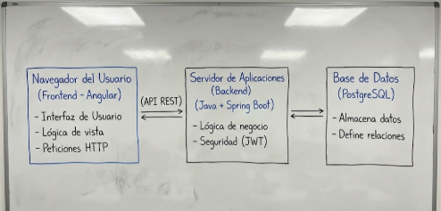
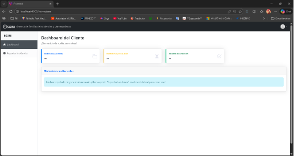
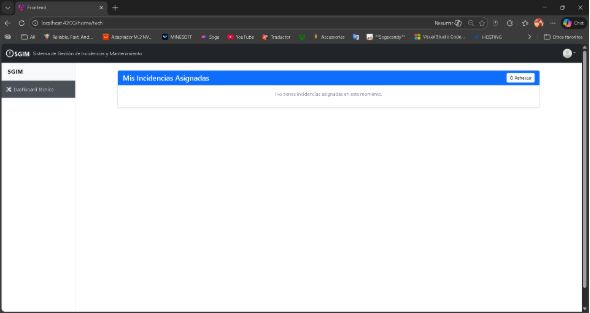
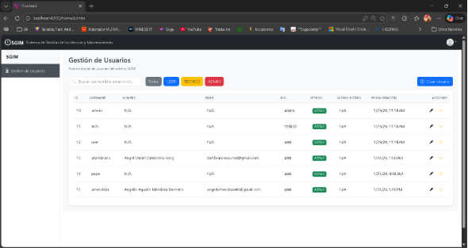
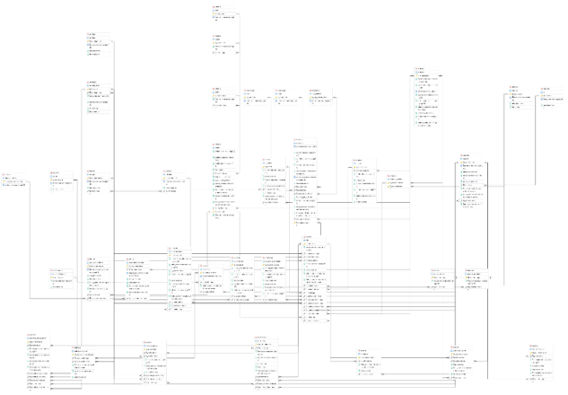
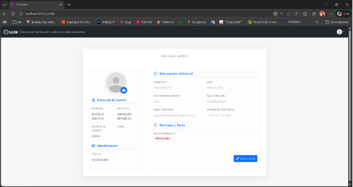
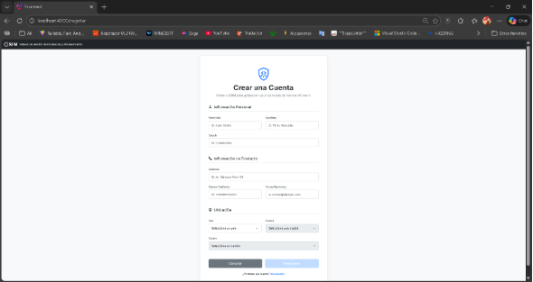
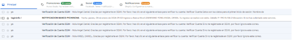
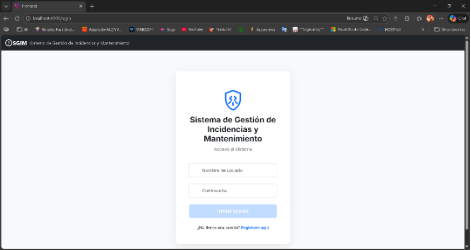

**UNIVERSIDAD TÉCNICA ESTATAL DE QUEVEDO**

**CARRERA:**

SOFTWARE

**DOCENTE:**

ING.

GUERRERO ULLOA GLEISTON CICERON

**ASIGNATURA:**

APLICACIONES WEB

**TEMA:** 

DESARROLLO DE UN SISTEMA WEB PARA LA GESTIÓN DE INCIDENCIAS Y MANTENIMIENTO DE LA RED DE INTERNET

**ESTUDIANTE:**

CRUZ PEREZ JUSTYN KEITH

MENDOZA BERMELLO ANGELLO AGUSTIN

MENDOZA MOREIRA ANDY EMANUEL

ZAMBRANO YONG ANGEL DANIEL

**AÑO LECTIVO**

2025 – 2026 PPA

1. **INTRODUCCIÓN**

La creciente dependencia de los servicios de internet en actividades académicas, comerciales y domésticas ha incrementado la necesidad de contar con mecanismos eficientes para la gestión de incidencias técnicas y el mantenimiento de la infraestructura de red. En muchos contextos, estos procesos aún se realizan de forma manual o mediante herramientas dispersas, lo que dificulta el seguimiento, la trazabilidad y la coordinación entre usuarios y personal técnico.

En este escenario, los sistemas web de gestión de incidencias se han consolidado como una solución clave para centralizar la información, mejorar los tiempos de respuesta y optimizar la comunicación entre los distintos actores involucrados. No obstante, gran parte de las soluciones existentes están orientadas a entornos corporativos de gran escala o a dominios muy específicos, lo que limita su adaptación a contextos operativos más cercanos, como los servicios locales de provisión de internet.

El presente proyecto propone el desarrollo de un Sistema Web para la Gestión de Incidencias y Mantenimiento de la Red de Internet, cuyo objetivo es ofrecer una plataforma centralizada, segura y escalable que permita registrar, gestionar y dar seguimiento a incidencias técnicas de manera estructurada. El sistema busca mejorar la eficiencia operativa del personal de soporte y brindar mayor transparencia al usuario final, alineándose con las tendencias actuales en el desarrollo de aplicaciones web y la gestión de servicios tecnológicos.

Este desarrollo se enmarca en un contexto tecnológico donde las arquitecturas de software modernas, como las Aplicaciones de Página Única (SPA) en el frontend y las API RESTful en el backend, permiten crear sistemas más rápidos, interactivos y fáciles de mantener. Al adoptar este enfoque desacoplado, el sistema no solo garantiza una experiencia de usuario fluida y responsiva, comparable a la de una aplicación de escritorio, sino que también asegura una separación clara de responsabilidades que facilita la escalabilidad y la evolución futura de la plataforma. La elección de estas tecnologías no es arbitraria, sino una decisión estratégica para construir una solución robusta y preparada para los desafíos del mañana.

El propósito de este documento es detallar de manera exhaustiva el ciclo de vida completo del desarrollo de este sistema, abarcando desde el análisis de requisitos y el diseño de la arquitectura hasta la implementación de sus componentes clave y las pruebas funcionales. Más allá de ser una simple herramienta técnica, este proyecto aspira a convertirse en un puente que fortalezca la relación entre el proveedor de servicios y sus clientes. Al ofrecer un canal de comunicación directo, transparente y eficiente, se busca no solo resolver problemas técnicos, sino también aumentar la confianza y la satisfacción del cliente, consolidando la calidad y la reputación del servicio en un mercado cada vez más competitivo.

1. **REVISIÓN DEL ESTADO DEL ARTE**
   1. ` `**Sistemas de gestión de incidencias existentes**

Diversos autores han abordado la problemática de la gestión de incidencias desde enfoques tecnológicos y contextos distintos. Por ejemplo, **Jazz et al.** y **Settanni et al.** coinciden en el desarrollo de sistemas web colaborativos orientados a la gestión de eventos críticos en infraestructuras complejas, utilizando arquitecturas centralizadas que permiten el registro, monitoreo y análisis histórico de incidentes para apoyar la toma de decisiones estratégicas[1], [2]. Estos trabajos destacan el valor de la interoperabilidad entre actores, aunque están enfocados principalmente en entornos institucionales de gran escala.

En contraste, otros estudios se centran en la automatización del análisis y clasificación de incidentes. Investigaciones como las de **Fugkeaw et al.** y **Libnao et al.** emplean técnicas de aprendizaje automático, como máquinas de soporte vectorial y algoritmos probabilísticos, para predecir el impacto o clasificar eventos específicos, como brechas de datos personales o accidentes de tráfico[3], [4]. Si bien estos enfoques mejoran la precisión del diagnóstico, su complejidad técnica puede dificultar su adopción en sistemas operativos más simples o de menor escala.

Por su parte, **Chen et al.** proponen modelos basados en grafos para la agregación de incidentes en servicios en línea de gran volumen, priorizando el análisis de relaciones entre eventos sobre la gestión operativa del ciclo de vida de una incidencia[5]. De manera complementaria, otros trabajos enfatizan la importancia de la seguridad de la información, incorporando esquemas de cifrado y control de acceso para garantizar el intercambio seguro de datos entre diferentes entidades[2], [6].

A partir del análisis comparativo, se evidencia que la mayoría de las soluciones existentes privilegian ya sea el análisis avanzado de datos o la gestión de infraestructuras críticas a gran escala. En este contexto, el sistema propuesto se diferencia al enfocarse en un entorno operativo más cercano, priorizando la gestión integral del ciclo de vida de las incidencias (registro, seguimiento, escalamiento y cierre) mediante una arquitectura web modular y segura. De esta manera, la propuesta busca equilibrar simplicidad operativa, trazabilidad y buenas prácticas de desarrollo, alineándose con las tendencias identificadas en el estado del arte, pero adaptadas a un contexto de aplicación más accesible y práctico.

La investigación académica también ha profundizado en el uso de máquinas de soporte vectorial (SVM) y sistemas basados en reglas para la clasificación automática del nivel de impacto en incidentes relacionados con brechas de datos personales[4]. Estos enfoques resaltan la necesidad de contar con mecanismos que permitan identificar rápidamente la gravedad de un incidente y definir planes de acción oportunos, con el fin de reducir tanto los daños financieros como los tiempos de recuperación operativa en organizaciones sujetas a normativas de protección de datos y privacidad[6].

De manera complementaria, en el ámbito de la ciberdefensa, se han propuesto marcos de trabajo que incorporan técnicas de cifrado basado en atributos (ABE) para asegurar el intercambio confiable de información sobre amenazas entre diferentes organismos[2]. Estas propuestas suelen integrarse con el desarrollo de aplicaciones web orientadas a la automatización de procesos, buscando optimizar la gestión de servicios críticos que tradicionalmente se realizaban de forma manual, y reforzando así la seguridad y eficiencia operativa de los sistemas[1].

1. ` `**Aporte del sistema propuesto**

El sistema propuesto se orienta a brindar una solución web para la gestión de incidencias y actividades de mantenimiento en la red de internet, abordando la necesidad de centralizar la información y mejorar la coordinación entre usuarios, personal técnico y administradores. A diferencia de los enfoques revisados, que suelen estar enfocados en dominios específicos o en infraestructuras de gran escala, la propuesta se adapta a un contexto operativo más cercano, permitiendo registrar, dar seguimiento y documentar incidencias de manera estructurada desde una única plataforma.

Uno de los principales aportes del sistema radica en la implementación de una arquitectura modular y desacoplada, que separa claramente el frontend del backend y facilita la escalabilidad y el mantenimiento de la aplicación. Además, el sistema incorpora desde sus primeras etapas un modelo de seguridad basado en roles y autenticación, garantizando que cada usuario acceda únicamente a las funcionalidades que le corresponden según su perfil, lo cual resulta fundamental en entornos donde intervienen distintos niveles de responsabilidad.

Asimismo, la plataforma establece una base sólida para la gestión ordenada del ciclo de vida de las incidencias, permitiendo registrar información relevante, mantener un historial de acciones y mejorar la trazabilidad de los casos atendidos. Este enfoque no solo contribuye a optimizar los tiempos de respuesta, sino que también sienta las bases para futuras mejoras, como el análisis de patrones recurrentes o la incorporación de mecanismos de apoyo a la toma de decisiones, alineando el sistema con las tendencias actuales en la gestión de incidencias técnicas.

1. **SISTEMA PROPUESTO**
   1. ` `**Descripción general del sistema**

SGIM es una aplicación web diseñada para ser el punto central de comunicación y gestión entre clientes que experimentan problemas con su servicio de internet y el personal técnico encargado de resolverlos. El sistema optimiza el flujo de trabajo, desde el reporte inicial hasta la resolución final, garantizando transparencia y eficiencia.                                                                                                                                                                                                                                                                                                                 

**Diagrama de Flujo Básico:**

Cliente reporta incidencia → Técnico recibe y diagnostica (Nivel 1) → ¿Se resuelve? → Sí: Cierra incidencia / No: Escala a visita (Nivel 2) → Técnico presencial resuelve → Cierra incidencia**.**

**Pasos detallados del proceso:**

1. **Registro y Autenticación**: Un nuevo cliente se registra en la plataforma, verifica su cuenta por correo electrónico y accede al sistema con sus credenciales.
1. **Creación de Incidencia:** El cliente, ya autenticado, completa un formulario para reportar una nueva incidencia, detallando el tipo y la descripción del problema. La incidencia se crea con un estado inicial de "Abierta".
1. **Diagnóstico y Gestión (Soporte Nivel 1):** Un técnico de soporte visualiza la nueva incidencia en su panel de control. Procede a contactar al cliente o a realizar diagnósticos remotos, actualizando el estado de la incidencia (ej. "En proceso") y añadiendo notas técnicas en el sistema.
1. **Escalamiento a Soporte Nivel 2:** Si el problema no puede ser resuelto de manera remota, el técnico escala la incidencia, cambiando su estado a "Escalada". Esto indica que se requiere una visita presencial.
1. **Resolución y Cierre:** Un técnico de Nivel 2 realiza la visita, soluciona el problema y actualiza la incidencia en el sistema, añadiendo los detalles de la resolución y cambiando el estado final a "Resuelta".
1. **Seguimiento del Cliente**: Durante todo el proceso, el cliente puede iniciar sesión en la plataforma para consultar el estado actual de su incidencia y ver el historial de cambios.

   1. **Arquitectura del sistema**
- El sistema sigue una arquitectura cliente-servidor moderna, que consta de:

- **Cliente (Frontend):** Una Aplicación de Página Única (SPA) desarrollada con ANGULAR y TYPESCRIPT. Responsable de la interfaz gráfica, es moderna, reactiva y se comunica con el backend a través de una API REST. Se utiliza Bootstrap para un diseño responsivo y pulido.

- **Servidor (Backend):** Una API RESTful robusta construida con JAVA 17 y el framework SPRING BOOT. Centraliza toda la lógica de negocio, seguridad con Spring Security (JWT)  y persistencia con Spring Data JPA.

- **Base de Datos (Persistencia):** Se utiliza PostgreSQL como motor de base de datos relacional.

1. ` `**Diseño e interfaces de usuarios**

La interfaz de SGIM ha sido diseñada priorizando la claridad, la usabilidad y una estética moderna. El diseño es completamente responsivo, adaptándose a ordenadores de escritorio, tabletas y dispositivos móviles.

- **Panel del Cliente:**

Una vez autenticado, el cliente accede a un panel minimalista desde donde puede registrar nuevas incidencias a través de un formulario guiado y visualizar el estado de sus reportes activos.

*Ilustración *3* Ejecución del proyecto- apartado visual (Panel Cliente).*

- **Panel del Técnico:**

El personal técnico cuenta con una vista especializada que lista las incidencias asignadas, permitiendo filtrarlas, actualizarlas y documentar las acciones realizadas.

*Ilustración *4* Ejecución del proyecto- apartado visual (Panel Técnico).*

- **Panel de Administración:**

El administrador tiene acceso a una sección de gestión de usuarios. Esta interfaz permite visualizar a todos los usuarios en una tabla con opciones de búsqueda y paginación, así como crear, editar y eliminar perfiles de usuario a través de formularios modales intuitivos.

*Ilustración *5* Ejecución del proyecto- apartado visual (Panel Administrador).*

1. **Herramientas utilizadas**

Para la construcción del sistema SGIM se ha seleccionado un conjunto de herramientas y tecnologías modernas y robustas, líderes en el desarrollo de aplicaciones web.

**Herramientas del Backend:**

- Lenguaje de Programación: Java (Versión 17).
- Framework Principal: Spring Boot.
- Módulos de Spring: Spring Web (API REST), Spring Security (Seguridad), Spring Data JPA (Acceso a datos).
- Base de Datos: PostgreSQL.
- Autenticación: JSON Web Tokens (JWT).
- Gestor de Dependencias y Construcción: Apache Maven.

`  `**Herramientas del Frontend:**

- Lenguaje de Programación: TypeScript.
- Framework Principal: Angular.
- Diseño y Estilos: Bootstrap.
- Comunicación HTTP: HttpClient de Angular.
- Gestor de Paquetes: npm (Node Package Manager).

`  `**Herramientas de Desarrollo y Colaboración:**

- Entornos de Desarrollo (IDEs): IntelliJ IDEA (para Java), Visual Studio Code (para Angular y TypeScript).
- Control de Versiones: Git.
- Plataforma de Colaboración: GitHub (o similar, para alojar el repositorio de código).

1. **METODOLOGÍA DE DESARROLLO**
   1. **Modelo de desarrollo seleccionado**

Para el desarrollo del proyecto SGIM, se ha seleccionado el modelo Scrum, que es uno de los marcos de trabajo más populares dentro de la metodología Ágil.

Se eligió Scrum porque su naturaleza iterativa e incremental es ideal para un proyecto como SGIM, donde los requisitos pueden evolucionar y es beneficioso entregar valor en ciclos cortos y manejables. Este enfoque permite una gran adaptabilidad a los cambios y fomenta la colaboración continua entre el equipo de desarrollo y los stakeholders (en este caso, el cliente o profesor).

El trabajo se organizará en Sprints, que son periodos de tiempo cortos (ej. 2 semanas) al final de los cuales se entregará un incremento funcional del producto. Las funcionalidades para desarrollar se gestionarán en un Product Backlog, y para cada Sprint se seleccionarán las tareas más prioritarias para formar el Sprint Backlog.

1. **Definición de requisitos**

A continuación, se detallan los requisitos funcionales y no funcionales identificados para el sistema SGIM.

**Requisitos funcionales** **(RF)**

Son las funciones que el sistema debe ser capaz de realizar.

**[RF1] Registro y autenticación de usuarios**

- El sistema debe permitir el registro de usuarios clientes y personal técnico mediante un formulario digital.
- El sistema debe validar el correo electrónico del usuario a través de un enlace de verificación.
- El sistema debe permitir el inicio de sesión seguro mediante credenciales y generación de token de autenticación (JWT).

**Nota:** Esta funcionalidad ya ha sido implementada, constituyendo un punto fuerte del avance del proyecto.

**[RF2] Gestión de roles de usuario**

- El sistema debe gestionar distintos roles de usuario: Cliente, Técnico y Administrador.
- El acceso a las funcionalidades del sistema debe estar restringido según el rol asignado.

**Nota:** Esta funcionalidad ya ha sido implementada mediante un único dashboard HTML que adapta dinámicamente las opciones visibles según el rol del usuario autenticado (Administrador, Técnico o Cliente), constituyendo un avance significativo en la gestión de permisos y seguridad del sistema.

**[RF3] Gestión del perfil de usuario**

- El sistema debe permitir a los usuarios consultar y actualizar sus datos personales como nombre, teléfono y dirección.
- El correo electrónico y rol del usuario serán solo de visualización.

**[RF4] Registro de incidencias por parte del cliente**

- El sistema debe permitir a los clientes registrar incidencias relacionadas con su servicio de internet.
- Cada incidencia debe incluir información como:
- Tipo de problema
- Descripción
- Fecha de reporte
- Estado inicial (Abierta)

**Nota:** Implementado. El sistema cuenta con un componente y los servicios necesarios para que un cliente autenticado pueda crear un nuevo ticket de incidencia.

**[RF5] Visualización del estado de incidencias**

- El sistema debe permitir a los clientes consultar el estado de sus incidencias registradas.
- Los estados posibles serán: Abierta, En proceso, Escalada y Resuelta.

**Nota:** Implementado. Los usuarios pueden ver una lista de sus tickets y el estado actual de cada uno, permitiendo un seguimiento transparente.

**[RF6] Gestión de incidencias por el personal técnico**

- El sistema debe permitir al personal técnico visualizar todas las incidencias asignadas.
- El técnico podrá actualizar el estado de la incidencia y agregar observaciones técnicas.

**Nota:** Implementado. Se ha desarrollado un panel específico para el rol de técnico que le permite visualizar la lista de incidencias que tiene asignadas.

**[RF7] Escalamiento de incidencias**

- El sistema debe permitir escalar incidencias que no puedan ser resueltas de manera remota a soporte presencial (Nivel 2).
- El escalamiento deberá quedar registrado en el historial de la incidencia.

**[RF8] Historial y seguimiento de incidencias**

- El sistema debe almacenar un historial de cambios de estado y observaciones realizadas sobre cada incidencia.
- El historial debe ser visible para técnicos y administradores.

**[RF9] Panel de administración**

- El sistema debe permitir a los administradores gestionar usuarios, roles y visualizar reportes generales de incidencias.

**Nota:** Implementado parcialmente. El sistema cuenta con un panel de administración robusto que permite la gestión completa de usuarios (crear, leer, actualizar y eliminar) y la asignación de roles. La generación de reportes es un trabajo a futuro.

**Requisitos no funcionales**

Son los atributos de calidad que describen cómo debe operar y ser el sistema.

**[RNF1] Seguridad de la información**

- El sistema debe garantizar la confidencialidad e integridad de los datos mediante el cifrado de contraseñas en la base de datos (hashing) y la autenticación basada en tokens JWT.
- El acceso a las funcionalidades y datos debe estar estrictamente controlado por los roles de usuario (Cliente, Técnico, Administrador).
- El sistema debe implementar validación de datos tanto en el frontend como en el backend para prevenir ataques comunes como la inyección de código (XSS, SQL Injection).
- La comunicación entre el cliente y el servidor debe realizarse a través del protocolo HTTPS en el entorno de producción para cifrar toda la información en tránsito.
- Los tokens de sesión (JWT) deben tener un tiempo de expiración razonable para mitigar el riesgo de secuestro de sesión.

**[RNF2] Usabilidad e Interfaz (Intuitiva y Responsiva)**

- La aplicación debe ser completamente responsiva, garantizando una experiencia de usuario óptima y accesible desde diferentes dispositivos (computadoras de escritorio, tabletas y teléfonos móviles).
- El sistema debe proporcionar retroalimentación clara al usuario, mostrando mensajes de confirmación, error o indicadores de carga durante las operaciones.
- Se buscará cumplir con estándares básicos de accesibilidad web (WCAG) para que pueda ser utilizado por personas con diversas capacidades.

**[RNF3] Rendimiento y Eficiencia**

- Las operaciones críticas como el inicio de sesión, registro de usuario y creación de incidencias deben completarse en menos de 2 segundos.
- Se deberán optimizar las consultas a la base de datos mediante el uso de índices y buenas prácticas de Spring Data JPA para asegurar un rendimiento eficiente, incluso con un gran volumen de datos.

**[RNF4] Disponibilidad y Fiabilidad**

- El sistema debe estar disponible para los usuarios el 99.5% del tiempo, accesible a través de cualquier navegador web moderno con conexión a internet.
- El sistema debe contar con un sistema de registro de errores (logging) tanto en el backend como en el frontend para facilitar la detección y diagnóstico rápido de problemas.

**[RNF5] Mantenibilidad y Escalabilidad**

- El código fuente debe seguir una estructura modular y estar bien documentado, adhiriéndose a las convenciones de los frameworks (Spring Boot y Angular) para facilitar futuras modificaciones y la incorporación de nuevos desarrolladores.
- La arquitectura debe estar diseñada para ser escalable, permitiendo que el sistema pueda crecer en número de usuarios y funcionalidades sin necesidad de un rediseño completo.
- El proceso de despliegue de nuevas versiones deberá ser lo más automatizado posible para reducir el riesgo de errores humanos. 

` `**Diseño**

1. **Implementación**

La fase de implementación se lleva a cabo de forma continua durante cada Sprint, donde el equipo de desarrollo se enfoca en construir las funcionalidades priorizadas del Product Backlog. Se sigue un enfoque de desarrollo basado en componentes, utilizando las tecnologías definidas:

- **Backend:** Se desarrolla con Java y el framework Spring Boot, construyendo las APIs RESTful que exponen la lógica de negocio y gestionan la persistencia de datos. Se aplican patrones de diseño y buenas prácticas de codificación para asegurar la calidad y mantenibilidad del código.
- **Frontend:** Se desarrolla con Angular y TypeScript, creando los componentes de la interfaz de usuario, la lógica de presentación y la interacción con el backend a través de los servicios HTTP.
- **Control de Versiones:** Se utiliza Git para la gestión del código fuente, facilitando la colaboración entre el equipo y manteniendo un historial de todos los cambios.

1. **Verificación y pruebas** 

La verificación y las pruebas son actividades integradas en cada Sprint, asegurando la calidad del software de manera continua:

- **Pruebas Unitarias:** Se desarrollan pruebas unitarias automatizadas para los componentes individuales del backend y frontend, garantizando que cada pieza del código funcione correctamente de forma aislada.
- **Pruebas de Integración:** Se realizan para verificar que los diferentes módulos y componentes del sistema interactúan correctamente entre sí, incluyendo la comunicación entre el frontend y el backend, y la interacción con la base de datos.
- **Pruebas de Aceptación (UAT):** Al final de cada Sprint, se realiza una revisión con los stakeholders (en la Sprint Review) para validar que las funcionalidades desarrolladas cumplen con los requisitos y expectativas del        usuario.
- **Pruebas Funcionales:** Se prueban las funcionalidades implementadas según los requisitos definidos para asegurar que el sistema hace lo que se espera.
  1. **Mantenimiento**

El mantenimiento se concibe como un proceso continuo que se integra en el ciclo de vida del proyecto. No es una fase separada, sino una actividad recurrente que puede generar nuevos elementos para el Product Backlog. Las actividades de mantenimiento incluyen:

- **Mantenimiento Correctivo:** Identificación y solución de defectos o errores (bugs) que se detectan después de la puesta en producción o durante las fases de prueba.
- **Mantenimiento Adaptativo:** Ajuste del sistema a cambios en el entorno tecnológico, como nuevas versiones de sistemas operativos, navegadores web o actualizaciones de librerías y frameworks.
- **Mantenimiento Perfectivo:** Implementación de mejoras en funcionalidades existentes, optimización del rendimiento o de la usabilidad, basándose en la retroalimentación de los usuarios o nuevas necesidades detectadas. Estas     mejoras se priorizan en el Product Backlog para ser implementadas en futuros Sprints.
- **Monitoreo:** Se implementarán herramientas de monitoreo para supervisar el rendimiento y la estabilidad del sistema, permitiendo una detección proactiva de posibles problemas.

1. **AVANCES DEL PROYECTO**
   1. **Funcionalidades implementadas**

El sistema cuenta actualmente con un módulo completo de gestión de acceso y autenticación de usuarios, que incluye las siguientes funcionalidades:

- **Registro de Usuarios:** Un nuevo usuario (cliente) puede crear una cuenta proporcionando sus datos personales (nombre, apellidos, cédula, etc.).

*Ilustración *7* Registro de Usuario*

- **Generación Automática de Credenciales:** Para simplificar el primer acceso, el sistema genera automáticamente un nombre de usuario único y una contraseña temporal segura.

- **Verificación de Cuenta por Correo Electrónico:** Tras el registro, se envía un correo de validación a la dirección del usuario con un enlace de activación. La cuenta permanece inactiva hasta que se verifica, garantizando la autenticidad del correo electrónico.

- **Autenticación Segura (Login):** Los usuarios con cuentas activadas pueden iniciar sesión. El sistema valida sus credenciales y, si son correctas, genera un Token JWT (JSON Web Token).

- **Gestión de Sesión Basada en Token:** El token JWT se utiliza para autorizar todas las peticiones posteriores a la API, permitiendo una arquitectura sin estado (stateless) que es moderna y escalable.
- **Soporte para Múltiples Roles:** La aplicación está diseñada para distinguir entre diferentes tipos de usuario (ej. ROLE\_USER, ROLE\_ADMIN, ROLE\_TECHNICIAN), sentando las bases para la autorización y control de acceso a futuras funcionalidades.
  1. **Componentes desarrollados**

Para lograr las funcionalidades mencionadas, se han desarrollado los siguientes componentes clave en el backend y frontend:

**Backend (Java / Spring Boot):**

- **Controlador (`AuthController`):** Gestiona las peticiones HTTP para el registro, login y verificación.
- **Modelos de Datos (`User`, `Role`):** Definen la estructura de los usuarios y roles en la base de datos.
- **Repositorios (`UserRepository`, `RoleRepository`):** Permiten el acceso y la manipulación de los datos en la base de datos.
- **Configuración de Seguridad (`SecurityConfig`):** Establece las reglas de acceso, la encriptación de contraseñas (usando BCrypt) y la configuración del filtro de autenticación JWT.
- **Utilidades JWT (`JwtUtils`):** Componente dedicado a la generación y validación de los tokens de acceso.
- **Servicio de Correo (`MailService`):** Se encarga de la lógica para enviar correos electrónicos de verificación.

**Frontend (Angular):**

- **Componentes de Interfaz (`LoginComponent`, `RegisterComponent`):** Formularios interactivos para que el usuario pueda registrarse e iniciar sesión.
- **Componentes de Paneles (`BoardUserComponent`, `BoardAdminComponent`, etc.):** Estructuras preparadas para mostrar información específica según el rol del usuario.
- **Servicios de Comunicación (`AuthService`):** Maneja la comunicación con la API del backend para enviar los datos de registro y login.
- **Servicio de Almacenamiento (`TokenStorageService`):** Almacena el token JWT de forma segura en el navegador del cliente para mantener la sesión activa.
- Módulo de Rutas (`AppRoutingModule`): Define la navegación dentro de la aplicación, protegiendo las rutas que requieren autenticación.

3. **Estado actual del sistema**

El sistema se encuentra en un estado funcional y estable, con la infraestructura base completamente terminada. Se ha completado el hito fundamental de la gestión de usuarios y seguridad. La aplicación es capaz de registrar usuarios, validar sus cuentas y gestionar sesiones de forma segura.

Actualmente, el proyecto funciona como un "esqueleto" robusto sobre el cual se pueden empezar a construir las funcionalidades específicas del negocio, como la gestión de incidencias, sin necesidad de preocuparse por la seguridad o el acceso de usuarios.

5. **RESULTADOS PARCIALES**

Hasta la fecha, se han alcanzado los siguientes resultados clave:

- Se ha establecido una arquitectura de aplicación web moderna y desacoplada (cliente-servidor), que facilita el mantenimiento y la escalabilidad futura del proyecto.
- Se ha logrado implementar un sistema de autenticación completo y seguro, basado en estándares actuales como JWT, que protege los datos y el acceso a la plataforma.
- El sistema es capaz de gestionar diferentes roles de usuario, lo que constituye un pilar fundamental para la lógica de negocio de SGIM, donde clientes y técnicos tendrán permisos distintos.
- Se ha integrado exitosamente un mecanismo de verificación por correo electrónico, aumentando la calidad y seguridad de los registros de usuarios.

5. **DISCUSIÓN**

La decisión de priorizar el desarrollo del módulo de autenticación y seguridad ha sido estratégica. Contar con esta base sólida desde el principio permite que el desarrollo futuro de las funcionalidades de negocio (la gestión de incidencias) se realice de forma más rápida y segura, ya que no será necesario reestructurar la seguridad más adelante.

La elección de JWT como mecanismo de autenticación responde a las tendencias actuales de desarrollo de API RESTful. Su naturaleza sin estado (stateless) simplifica la escalabilidad del backend, ya que el servidor no necesita almacenar información de la sesión de cada usuario.

Un punto para considerar es la dependencia de un servicio de correo electrónico funcional (MailService). Para un entorno de producción, será crucial asegurar que este servicio sea fiable y esté correctamente configurado para garantizar que los nuevos usuarios puedan activar sus cuentas sin problemas.

5. **CONCLUSIONES PARCIALES**
1. La base tecnológica y arquitectónica seleccionada para el proyecto (Spring Boot + Angular) es adecuada y robusta para cumplir con todos los requisitos del sistema SGIM.
1. El módulo de gestión de usuarios y seguridad se ha implementado de manera exitosa y completa, cumpliendo con los estándares modernos de seguridad y usabilidad.
1. El proyecto ha alcanzado un punto de madurez fundamental, concluyendo la Fase 1 (Infraestructura y Seguridad) y está en una posición óptima para comenzar la Fase 2 (Lógica de Negocio).

5. **TRABAJO FUTURO**

El siguiente paso lógico y prioritario es el desarrollo del módulo central de SGIM: la gestión de incidencias. El plan de trabajo futuro se desglosa en:

1. **Backend:**
- Diseñar y crear el modelo de datos Incident.java.
- Implementar el IncidentController con endpoints para crear, visualizar, actualizar y asignar incidencias.
- Desarrollar la lógica de negocio en un IncidentService para gestionar los estados de una incidencia (ej. "Abierta", "En Proceso", "Resuelta", "Escalada").
1. **Frontend:**
- Crear una nueva vista con un formulario para que los clientes (ROLE\_USER) puedan reportar una nueva incidencia.
- Desarrollar un panel de control para que el personal de soporte (ROLE\_TECHNICIAN) pueda ver la lista de incidencias, filtrarlas y actualizar su estado.
- Integrar las nuevas vistas con los servicios correspondientes para que se comuniquen con los nuevos endpoints del backend.

5. **BIBLIOGRAFÍA**

[1]	Jazz Pablo, Charmaine Joyce Pajigal, Christine Palileo, and Eric Blancaflor, “2020 IEEE 7th International Conference on Industrial Engineering and Applications : ICIEA 2020 : April 16-21, 2020, Bangkok, Thailand,” IEEE, Apr. 2020. doi: 10.1109/ICIEA49774.2020.9101965.

[2]	G. Settanni *et al.*, “A collaborative cyber incident management system for European interconnected critical infrastructures,” *Journal of Information Security and Applications*, vol. 34, pp. 166–182, Jun. 2017, doi: 10.1016/j.jisa.2016.05.005.

[3]	S. Fugkeaw, N. Kuasomboon, and P. Panakitkul, “DBIM: An Efficient and Resilient PII Data Breach Incident Management System,” in *KST 2021 - 2021 13th International Conference Knowledge and Smart Technology*, Institute of Electrical and Electronics Engineers Inc., Jan. 2021, pp. 237–242. doi: 10.1109/KST51265.2021.9415822.

[4]	M. Libnao, M. Misula, C. Andres, J. Mariñas, and A. Fabregas, “Traffic incident prediction and classification system using naïve bayes algorithm,” in *Procedia Computer Science*, Elsevier B.V., 2023, pp. 316–325. doi: 10.1016/j.procs.2023.10.530.

[5]	Z. Chen *et al.*, “Graph-based Incident Aggregation for Large-Scale Online Service Systems,” Aug. 2021, doi: 10.48550/arXiv.2108.12179.

[6]	Hamid R. Motahari Nezhad, Claudio Bartolini, and Parag Joshi, *2011 IEEE 27th International Conference on Data Engineering Workshops*. IEEE, 2011. doi: 10.1109/ICDEW.2011.5767639.

